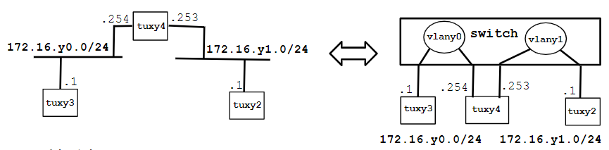

# Steps

1. Transform tuxy4  (linuxmachine) into a router
    - Configure also tuxy4.eth1 
    - Enable IP forwarding 
    - Disable ICMP echo-ignore-broadcast
2. Observe MAC addresses and IP addresses in tuxy4.eth0 and tuxy4.eth1
3. Reconfigure tuxy3 and tuxy2 so that each of  them can  reach the other
4. Observe the routes available at the 3 tuxes  (route  –n)
5. Start capture at tuxy3
6. From tuxy3, ping the other network interfaces (172.16.y0.254, 172.16.y1.253, 172.16.y1.1) and verify if there is connectivity.
7. Stop capture and save logs
8. Start capture in tuxy4; use 2 instances of Wireshark, one per network interface
9. Clean the ARP tables in the 3 tuxes
10. In tuxy3, ping tuxy2 for a few seconds.
11. Stop captures in tuxy4 and save logs

# Step 1

## Fazer as ligaçoes dos cabos

### Ligar Cabos
```powershell
TUX23E0  -> Switch Porta 1 
TUX22E0  -> Switch Porta 2
TUX24E0  -> Switch Porta 3
TUX24E1  -> Switch Porta 4
```

| --- | --- | --- |
|--------|-------|----|
| TUX23E0 (1) | TUX24E0 (3) | empty (5) |
| TUX22E0 (2) | TUX24E1 (4) | empty (6) |

### Configurar IP's

**tux23**:
```powershell
> ifconfig eth0 up
> ifconfig eth0 172.16.20.1/24
> ifconfig eth0 
```
| IP | MAC |
|--------|-------|
| 172.16.20.1  | 00:21:5a:5a:7d:12 |

**tux24**:
```powershell
> ifconfig eth0 up
> ifconfig eth0 172.16.20.254/24
> ifconfig eth0 
```
| IP | MAC |
|--------|-------|
| 172.16.20.254  | 00:08:54:50:3f:2c |
```powershell
> ifconfig eth1 up
> ifconfig eth1 172.16.21.253/24
> ifconfig eth1 
```
| IP | MAC |
|--------|-------|
| 172.16.21.253  | 00:22:64:a6:a4:f1 |

**tux22**:
```powershell
> ifconfig eth0 up
> ifconfig eth0 172.16.21.1/24
> ifconfig eth0 
```

tux2
| IP | MAC |
|--------|-------|
| 172.16.21.1  | 00:21:5a:61:2b:72 |

### Configurar VLAN's

Ligas um Cabo `S0`, like tux23, ao switch e fazes como em [exp2](./Guião_exp2.md#step-2)

VLAN 0:
 - tux23 eth0 -> port 1
 - tux24 eth0 -> port 3

VLAN 1:
 - tux22 eth0 -> port 2
 - tux24 eth1 -> port 4
 - 
### Enable IP forwarding
No slide 44 temos `echo 1 > /proc/sys/net/ipv4/ip_forward`, fazer isto no tux24

### Disable ICMP echo-ignore-broadcast
No slide 44 temos `echo 0 > /proc/sys/net/ipv4/icmp_echo_ignore_broadcasts`, fazer isto no tux24

# Step 2
Preencher em cima o [tux24](#configurar-ips) 

Que conclusões se tira daqui?

# Step 3

Maybe é para brincar com as rotas, temos isto no Slide 42:

```powershell
adicionar rota para subrede no tux23:
    – root# route add -net 172.16.21.0/24 gw 172.16.20.254
```

Testa pingar o tux22 a partir do tux23 e o oposto para ver se chegam um ao outro

Se conseguir pingar tux23, repetir step 3 para tux22.

```powershell
adicionar rota para subrede no tux22:
    – root# route add -net 172.16.20.0/24 gw 172.16.21.253
```

# Step 4

Fazer `route -n` em cada 1 dos 3 tuxs. Tens [aqui](./Guião_exp1.md#step-5) o significado do que vai resultar

# Step 5

Passar para tux23. Ligar o WireShark e começar a capturar pacotes na eth0

# Step 6

A partir do tux23:
- pingar a eth0 do tux24 - `ping 172.16.20.254`
- pingar a eth1 do tux24 - `ping 172.16.21.253`
- pingar a eth0 do tux22 - `ping 172.16.21.1`  

Para cada um verificar a conectividade

# Step 7

Para a captura no tux23 e guardar logs como `exp3_step7.pcapng`

# Step 8

- Passar para o tux24.
- Ligar duas instâncias de WireShark. Uma para o eth0 e outra para o eth1. 
- Começar a capturar na eth0 e começar a capturar na eth1.

# Step 9

- No tux24, apagar a tabela ARP e verificar se estão limpas
```powershell
> arp -d 172.16.20.254
> arp -a [retorna nada]
```
- Trocar para o tux22 e fazer o mesmo
- Trocar para o tux23 e fazer o mesmo
  
# Step 10

No tux23 começar a pingar o tux22 `ping 172.16.21.1` e ao fim de 10 pings fazer CTRL+C.

# Step 11

Passar para tux24, parar a captura e guardar o ficheiro como: `exp3_step11.pcapng`