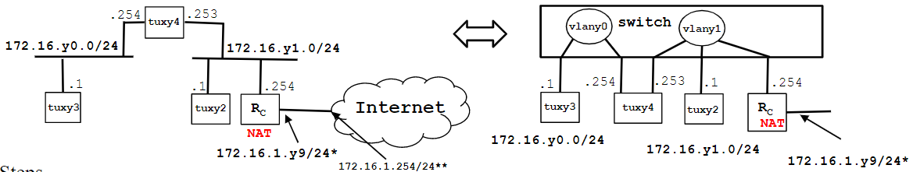

# Steps
1. Configure commercial router RC and connect it (no NAT) to the  lab network  (172.16.1.0/24)&ast;
2. Verify routes
    - tuxy4 as default router of tuxy3; Rcas default router for tuxy2 and tuxy4
    - Routes for 172.16.y0.0/24 in tuxy2 and Rc
3. Using ping commands and wireshark, verify if tuxy3 can ping all the network interfaces of tuxy4, tuxy2 and Rc
4. In  tuxy2
    - Do:  echo 0 > /proc/sys/net/ipv4/conf/eth0/accept_redirects and  echo 0 > /proc/sys/net/ipv4/conf/all/accept_redirects
    - remove the route to 172.16.y0.0/24 via tuxy4
    - In tuxy2, ping  tuxy3
    - Using capture at tuxy2, try to understand the path followed by ICMP ECHO and  ECHO-REPLY packets  (look at MAC addresses)
    - In tuxy2, do traceroute tuxy3
    - In tuxy2, add again the route to 172.16.y0.0/24 via tuxy4 and  do  traceroute tuxy3
    - Activate the acceptance of  ICMP redirect at tuxy2 when there is no route to 172.16.y0.0/24 via tuxy4 and try to understand  what happens
5. In tuxy3, ping the router of the lab I.321 (172.16.1.254)** and try to understand what  happens
6. Add NAT functionality to router Rc
7. In tuxy3 ping 172.16.1.254&ast;&ast;, verify if there is connectivity, and try to understand what happens
   
&ast; In room I320 the lab network address is 172.16.2.0/24

&ast;&ast; Router of  lab I320 has IP address 172.16.2.254

# Step 1

### Ligar Cabos
Não tenho a certeza se o Router já está ligado ao switch ou não, tens de verificar aí. Pelo Slide 50 eles parecem estar ligados a partir da porta `Con`, but i'm not sure.
```powershell
TUX23E0  -> Switch Porta 1 
TUX22E0  -> Switch Porta 2
TUX24E0  -> Switch Porta 3
TUX24E1  -> Switch Porta 4
```

| --- | --- | --- |
|--------|-------|----|
| TUX23E0 (1) | TUX24E0 (3) | empty (5) |
| TUX22E0 (2) | TUX24E1 (4) | empty (6) |

### Configurar IP's

Tal como na [experiência 3](./Guião_exp3.md#configurar-ips) a configuração é igual. 

Deve ser preciso configurar o router, para isso temos no slide 45:
```powershell
»interface gigabitethernet 0/0                  (0/0 - não sei que valores são estes :( )
»ip address 192.168.12.2    255.255.255.0       (deve ser endereço e máscara aka /24 )
»no shutdown 
»exit 
»show interface gigabitethernet 0/0     
```

> and connect it (no NAT) to the  lab network  (172.16.1.0/24)

^ Not sure como fazer isto, secalhar também é na configuração do router. Temos também o slide 46 com informação:

```powershell
conf t 
interface gigabitethernet 0/0 * 
ip address 172.16.y1.254 255.255.255.0 
no shutdown 
ip nat inside 
exit 

interface gigabitethernet 0/1 * 
ip address 172.16.1.y9 255.255.255.0 
no shutdown 
ip nat outside 
exit 

ip nat pool ovrld 172.16.1.y9 172.16.1.y9 prefix 24 
ip nat inside source list 1 pool ovrld overload 

access-list 1 permit 172.16.y0.0 0.0.0.7 
access-list 1 permit 172.16.y1.0 0.0.0.7 

ip route 0.0.0.0 0.0.0.0 172.16.1.254 
ip route 172.16.y0.0 255.255.255.0 172.16.y1.253 
end

* In room I320 use interface fastethernet
```

# Step 2
Usar:
```powershell
> route -n
```
Para verificar:
- tuxy4 as default router of tuxy3
- Rcas default router for tuxy2 and tuxy
- Routes for 172.16.y0.0/24 in tuxy2 and Rc

# Step 3

Parecido com [Step 6 de exp3](./Guião_exp3.md#step-6).

No tux23, começar o wireshark e a capturar pacotes, pingar tux22, eth0 de tux24, eth1 de tux24 e Rc.

10 pings para cada e guardar o ficheiro como `exp4_step3.pcapng`

# Step 4

Passar para tux22. Alguns pontos têm comentários, outros são self-explanatory:

> - Do:  echo 0 > /proc/sys/net/ipv4/conf/eth0/accept_redirects and  echo 0 > /proc/sys/net/ipv4/conf/all/accept_redirects


> - remove the route to 172.16.y0.0/24 via tuxy4

Passar para tux24 e usar comandos de baixo
```powershell
Para ver tabela
> route -n
Para apagar entrada
> sudo route del -net 192.168.3.0 gw 192.168.1.1 netmask 255.255.255.0 dev eth0
```
> - In tuxy2, ping  tuxy3

A rota para o tux23 foi removida, será que chega?

> - Using capture at tuxy2, try to understand the path followed by ICMP ECHO and  ECHO-REPLY packets  (look at MAC addresses)

começar a capturar pacotes em tux22 e dar ping a tux23. Guardar os logs como `exp4_step4.pcapng`


> - In tuxy2, do traceroute tuxy3

https://www.howtogeek.com/657780/how-to-use-the-traceroute-command-on-linux/

A partir daqui sabemos por onde passam os pacotes para chegar a um sitio, acho que o suposto é passar pelo tux24 eth1 (172.16.21.253) e eth0 (172.16.20.254)

> - In tuxy2, add again the route to 172.16.y0.0/24 via tuxy4 and  do  traceroute tuxy3

Again, o que acontecerá?

> - Activate the acceptance of ICMP redirect at tuxy2 when there is no route to 172.16.y0.0/24 via tuxy4 and try to understand what happens


```powershell
-- Apagar a entrada 172.16.y0.0/24 outra vez no tux24
route -n
route del

-- ativar estas coisas
echo 1 > /proc/sys/net/ipv4/conf/eth0/accept_redirects 
echo 1 > /proc/sys/net/ipv4/conf/all/accept_redirects
```

fazer alguns passos de cima como o `traceroute` e secalhar criar uns logs `exp4_step4_lastpoint.pcapng`

# Step 5

Passar para tux23 e fazer
```powershell
ping 172.16.1.254
```
Maybe dá para fazer um log com isto : `exp4_step5_.pcapng`

# Step 6

> Add NAT functionality to router Rc

🙃

# Step 7

Mesmo que o [Step 5](#step-5). Deve ser para fazerum log com isto também : `exp4_step7_.pcapng`