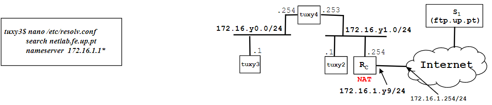

# Steps

1. Configure DNS at  tuxy3, tuxy4, tuxy2; use DNS server services.netlab.fe.up.pt (172.16.1.1&ast;)
2. Verify if names can be used in these hosts (e.gping hostname, use browser)
3. Execute ping new-hostname-in-the-Internet; observe DNS related packets in Wireshark

&ast;In room I320 the DNS server address is 172.16.2.1

# Step 1

Primeiro é necessário configurar tudo como na **Exp 4**.

Uma das perguntas é `How to configure the DNS service at an host?`. Bota descobrir como fazer isso e fazer nos tux22, tux23, tux24.

secalhar é para usar o que está no lado esquerdo da imagem 👀 https://en.wikipedia.org/wiki/Resolv.conf

# Step 2

Verificar se a configuração ficou bem feito usando ping com nomes em vez de IP's
```powershell
ping nome_com_que_fica
```

# Step 3

Ligar wireshark e fazer:
```powershell
ping new-hostname-in-the-Internet
```
Como de costume, 10 pings, CTRL+C e guardar log como `exp5_step3.pcapng`