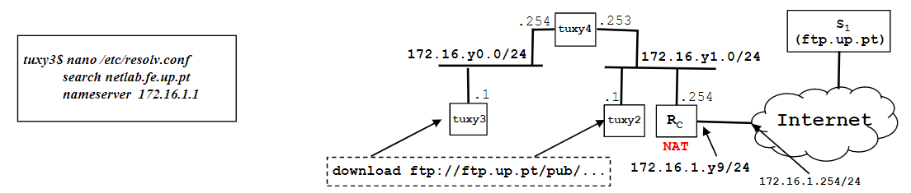

# Steps

1. Compile your dowonloadapplication in tuxy3
2. In tuxy3, restart capturing with Wireshark and run your  application  download ftp://ftp.up.pt/...
3. Verify if file has arrived correctly, stop capturing and save the log
4. Using Wireshark observe packets exchanged including:
    - TCP  control and data connections, and its phases (establishment, data, termination)
    - Data transferred through the FTP control connection
    - TCP ARQ mechanism
    - TCP congestion control mechanism in  action
    - Note: use also Wireshark  Statistics tools (menu) to study TCP phases, ARQ and congestion control mechanism
5. Repeat download in tuxy3 but now, in the middle of the transference, start a new download in tuxy2
    - Use the Wireshark statistics tools to understand how the throughput of  a TCP connection varies along the time