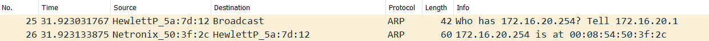
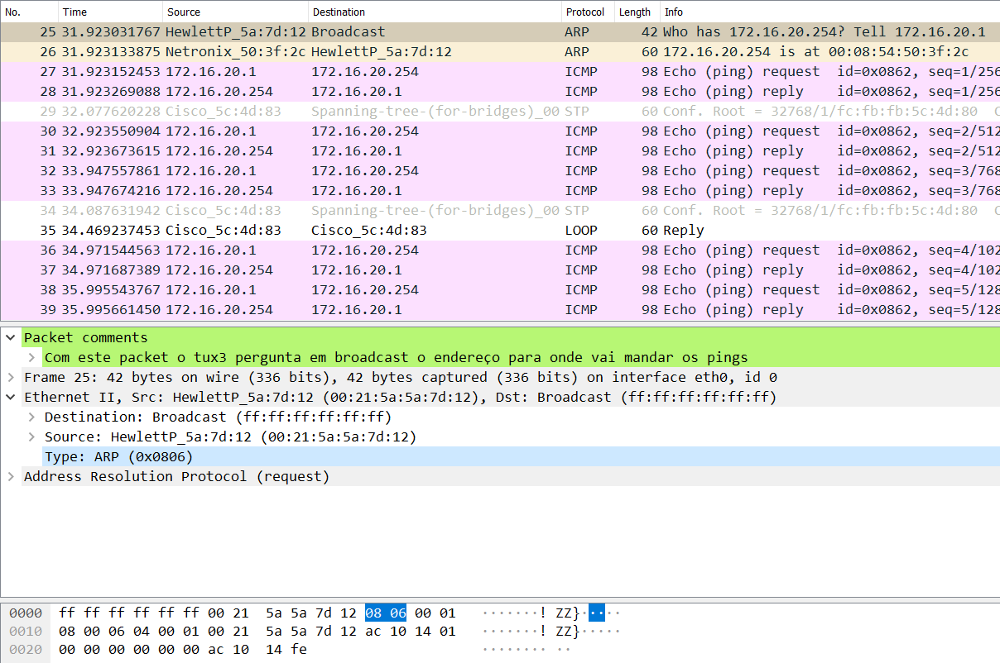
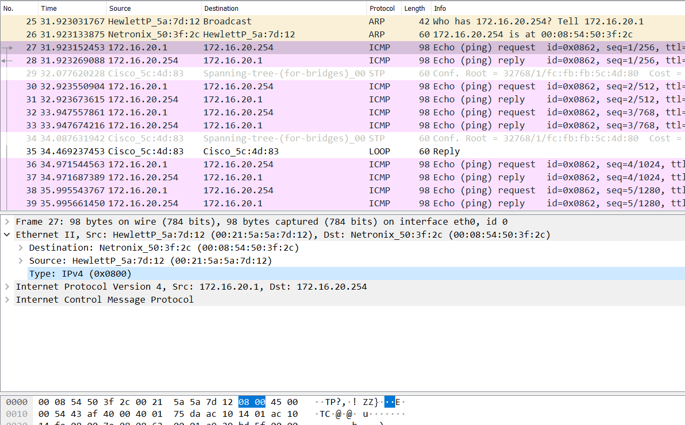

## What are the ARP packets and what are they used for?
Adress Resolution Protocol.  
Pacotes ARP são usados para, sabendo o endereço IP de uma máquina, pedir o endereço MAC [Slide 32 - PP6]

## What are the MAC and IP addresses of ARP packets and why?
Medium Access Control, Internet Protocol.  
Endereços IP servem como um identificador público que cada máquina necessita de usar numa rede para conseguir comunicar.  
Endereços MAC são os identificadores das placas de rede. Um computor pode ter muitos endereços IP mas só pode ter 1 endereço MAC
## What packets does the ping command generate?
ICMP - Internet Control Message Protocol  
Usado pelo router ou host para mandar erros da camada 3 ou mensagens de controlo para outros routers ou hosts. [Slide 51 - PP6]
## What are the MAC and IP addresses of the ping packets?
IP/MAC da máquina que enviou o ping e da máquina que recebe o ping

## How to determine if a receiving Ethernet frame is ARP, IP, ICMP?
Verificando os 2 bytes `Type` da trama do tipo Ethernet.
[Slide 32 - PP5]
| ARP                    | ICMP                     |
|------------------------|--------------------------|
|  |  |
## How to determine the length of a receiving frame?
1. Pelo wireshark, temos a camada mais superior `Frame` que contém o campo `Frame Length` com o número de bytes da trama.
2. Para frames IPv4 temos o campo `Total Lenght`. Possivel de verificar num packet de ping
3. [Slide 32 - PP5] Em tramas IEEE 802.3 o `Type` é substituido por `Length`
## What is the loopback interface and why is it important?
Interface loopback serve para verificar se a rede está corretamente estruturada. Uma máquina manda um pacote cujo endereço de destino é ele mesmo, se receber o pacote então a rede está organizada.
[https://www.juniper.net/documentation/en_US/junos/topics/concept/interface-security-loopback-understanding.html]